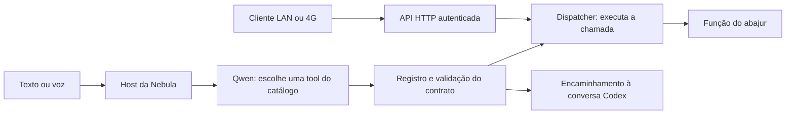

# Fluxo de tools da Nebula

## Separação atual



- `core/registry.py`: registra funções, contratos e descrições; lista tools.
- `core/dispatcher.py`: valida o plano inteiro, executa e para em falha ou
  confirmação pendente. Não interpreta texto, conhece dispositivos ou chama LLM.
- `core/bootstrap.py`: composição das funções disponíveis no host.
- `core/action_contracts.py`: contratos das ações que já existiam na Nebula.
- `integrations/llm/qwen.py`: conversa, prompt e seleção de tools pela Qwen.
- `integrations/codex/client.py`: encaminhamento ao canal Codex existente.
- `modules/iot/lights.py`: execução direta dos pedidos do abajur.
- `services/tool_server.py`: transporte HTTP genérico e autenticado, independente
  de `main.py`, GUI, Qwen e das regras dos dispositivos.
- `services/network.py`: catálogo remoto e chamada com preferência por LAN.

Com `NEBULA_QWEN_ENABLED=1`, a Qwen recebe o catálogo do registro e escolhe as
ações, inclusive para comandos conhecidos. Ações do abajur e ações que recebem
texto são chamadas diretamente, sem converter argumentos em frases para outra
rodada de interpretação. A Qwen não executa comandos nem escolhe endereços de rede.

Confirmações pendentes, repetição do último comando do abajur, saída e comandos
locais de memória/preset continuam no host. Com a Qwen desativada, o vocabulário
local existente permanece disponível. Não foi alterada a configuração de ativação
do modelo nos dispositivos. Use `NEBULA_OLLAMA_URL` e `NEBULA_OLLAMA_MODEL` para
escolher onde roda a Qwen e qual modelo usar.

## API genérica

O painel desktop disponibiliza as novas rotas na porta existente, 8765:

- `GET /api/tools`: retorna `{"tools": [...]}` com `name`, `description` e
  `inputSchema` de cada tool registrada.
- `POST /api/tools/call`: recebe nome e argumentos e devolve o resultado.

Exemplo de corpo da chamada:

```json
{"name":"abajur_brilho","arguments":{"argumento":"45"}}
```

As rotas do painel usam a mesma autenticação por token/cookie do login existente.
O cliente envia o token no cabeçalho `X-Nebula-Token`.
O servidor não analisa se a ação significa luz, programa ou código. O módulo
registrado define o contrato e executa. Rotas antigas continuam presentes para
compatibilidade com os frontends atuais.

Um nó dedicado pode ser iniciado sem GUI e sem consultar a Qwen:

```powershell
# Defina NEBULA_TOOL_TOKEN (mínimo de 24 caracteres) no ambiente local.
# O bind explícito em 0.0.0.0 permite acesso pela LAN/Tailscale.
.\.venv\Scripts\python.exe -m scripts.run_tool_server --host 0.0.0.0 --port 8767
```

Esse launcher publica somente as tools do abajur, a primeira funcionalidade
migrada. A composição ainda reutiliza o estado/driver de `Nebula`; o transporte
é independente e também pode receber outro registro. O token desse servidor
é o configurado em `NEBULA_TOOL_TOKEN`, separado do token do painel desktop.
Sem `--host`, o launcher escuta somente em `127.0.0.1`.

## LAN e 4G, sem SSH

Os endereços LAN e Tailscale de PC e notebook já constam no Android existente.
O cliente Python novo recebe os dois endereços explicitamente:

```python
from services.network import DeviceConnection, DeviceEndpoint

connection = DeviceConnection(DeviceEndpoint(
    lan_url="http://<ip-do-pc-na-lan>:8767",
    remote_url="http://<ip-do-pc-no-tailscale>:8767",
    token=token_local,  # carregado localmente; não entra no prompt da Qwen
))
resultado = connection.call_tool("abajur_ligar", {"argumento": ""})
```

A descoberta tenta a LAN primeiro. Se ela estiver inacessível, tenta a rota
remota configurada. Não há comandos SSH nesse fluxo. No 4G, o celular e o PC
precisam alcançar a mesma rede Tailscale e a porta do serviço deve estar
permitida entre eles. O PC precisa estar ligado e executando a API. Tailscale
é a rede privada de transporte, sem necessidade de usar Tailscale SSH.
Veja a [configuração oficial de dispositivos](https://tailscale.com/docs/how-to/quickstart).

Após enviar um comando, timeout não provoca reenvio automático por outra rota:
o efeito pode já ter ocorrido. O cliente informa que não recebeu confirmação.
Nenhum túnel, firewall ou serviço nos outros aparelhos foi reconfigurado nesta
etapa. A seleção LAN/remota foi testada com rede simulada; o teste HTTP real foi
em loopback, sem hardware e sem teste real pelo 4G.

`NEBULA_POWER_TOKEN` não possui mais valor fixo no código. Gere um token novo
com pelo menos 24 caracteres e configure o mesmo valor no PC, notebook e no
ambiente usado para compilar o Android. O Gradle injeta esse valor em
`BuildConfig.NEBULA_POWER_TOKEN`; sem ele, as funções autenticadas entre aparelhos
ficam indisponíveis. Como o valor antigo esteve no histórico Git, ele deve ser
considerado revogado e não deve ser reutilizado.

## Conversa de código

A Qwen pode selecionar `encaminhar_codex`. O host encaminha o texto original,
preservando maiúsculas e pontuação. Na GUI, abre a aba Grupo e usa a ponte Codex
existente. No modo texto, a resposta chega pela saída da Nebula.

Essa é uma conversa com Codex via integração CLI, não uma transferência para a
sessão aberta deste chat. O canal atual do Grupo é consultivo e não edita arquivos
automaticamente. O executável/login do Codex precisa estar disponível; falhas
aparecem no canal. O estado `queued` indica aceitação para processamento, não
resposta concluída. Referência: [Codex não interativo](https://learn.chatgpt.com/docs/non-interactive-mode).

## Próximas migrações

Ainda existe código de orquestração em `main.py`. Algumas ações sem argumentos
usam frases fixas em `core/legacy_actions.py` para acessar os executores antigos.
Os drivers Tuya e parser continuam na raiz. `conversa_local.py` e
`config_modelo.py` são pequenos arquivos de compatibilidade com imports antigos.

O protocolo novo desta etapa é HTTP/JSON, ainda não MCP. Falta o adaptador MCP
e a associação automática de tools de vários servidores ao catálogo da Qwen.
O cliente remoto já permite consultar e chamar cada servidor explicitamente.
Não é necessário modificar o servidor genérico para registrar outra função.

Testes: `python -m unittest discover -s tests` cobre registro, host, abajur,
encaminhamento, troca de rota e transporte HTTP, sem acionar dispositivos reais.
