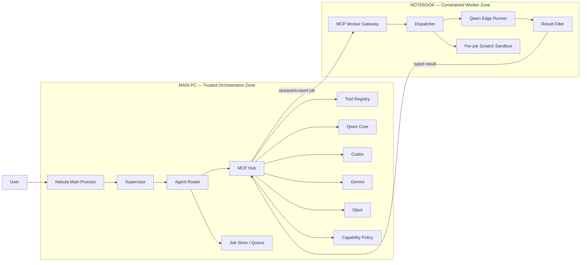
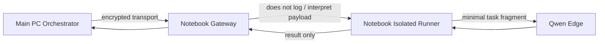
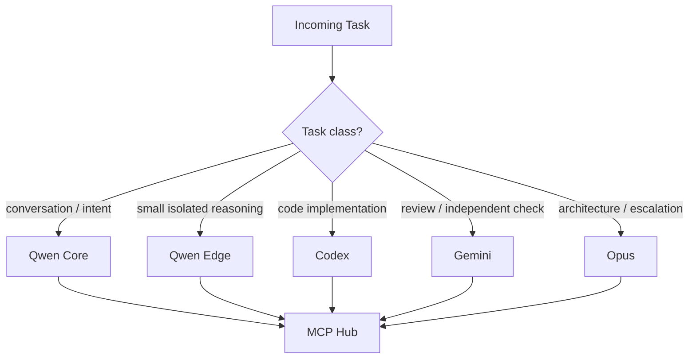
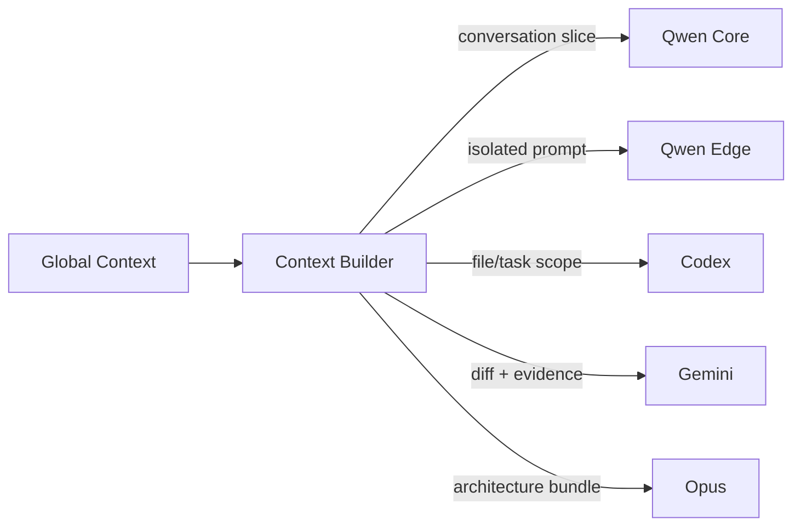
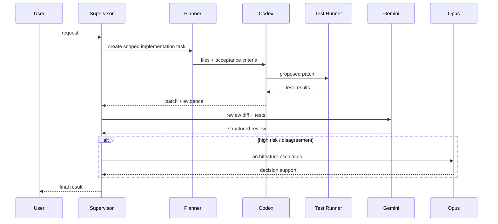
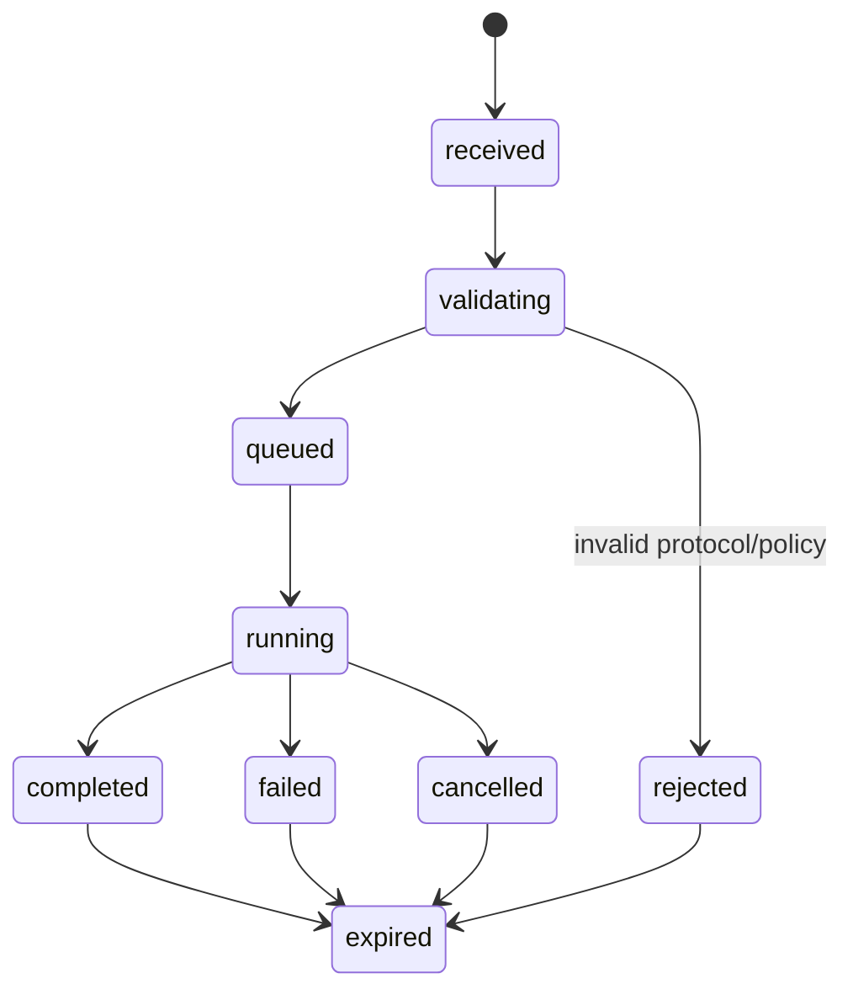

# GOAL — Nebula MCP Distributed Agent Runtime

> **Status:** architecture target  
> **Audience:** AI coding agents, maintainers, reviewers, Codex, Gemini, Claude/Opus, Qwen agents  
> **Primary objective:** transform the Nebula AI layer into a distributed MCP-based runtime where the main PC owns orchestration and meaning, while the notebook acts as a constrained execution worker.

---

## 0. How an AI should read this document

This file is the architectural source of truth for the MCP/agent layer of Nebula.

When implementing changes:

1. Preserve the boundaries defined in **Architecture Invariants**.
2. Prefer small modules with explicit contracts over shared global state.
3. Do not give the notebook worker access to the complete Nebula goal, conversation history, unrestricted filesystem, or unrestricted shell.
4. Do not let individual agents directly call arbitrary Nebula functions.
5. All tools must be registered and invoked through the central tool/capability layer.
6. All remote execution must use typed job envelopes and typed results.
7. The main PC is authoritative for orchestration.
8. The notebook is a worker, not a supervisor.
9. Model names are configuration, not architecture. Code must use logical aliases.
10. Existing functional Nebula modules should be migrated incrementally, not rewritten all at once.

---

# 1. Goal

Build a modular distributed AI runtime for **Nebula** with:

- **Qwen Core** — larger local Qwen on the main PC.
- **Qwen Edge** — Qwen running on the notebook, currently via Ollama.
- **Codex** — coding/implementation agent.
- **Gemini** — reviewer/research/secondary reasoning agent.
- **Claude Opus** — architecture/review/high-context agent.
- **Nebula Tools** — controlled access to desktop, IoT, media, memory, hardware, project, browser and other Nebula capabilities.
- **MCP Hub** — the single coordination boundary between agents and tools.
- **Job Router** — selects an agent/worker without exposing more context than necessary.
- **Capability Policy** — determines which tools a specific job may use.
- **Audit Layer** — records metadata, decisions, tool usage and results without unnecessarily storing private prompt contents.
- **Notebook MCP Worker** — remote compute worker that receives narrowly scoped jobs and does not know the global objective.

The desired architecture must support both:

- interactive Nebula conversations; and
- autonomous `ai_sprints` / autopilot jobs.

---

# 2. Core architectural idea

The system is divided into two trust zones.



The **main PC understands the global goal**.

The **notebook does not**.

The notebook receives only the minimum task fragment required for the selected model operation.

---

# 3. Architecture invariants

These rules are mandatory.

## INV-001 — Main PC owns intent

Only the main orchestration layer may hold:

- global user objective;
- complete plan;
- full conversation context;
- complete sprint context;
- cross-agent reasoning state;
- unrestricted tool routing state.

The notebook worker must not become a second supervisor.

---

## INV-002 — Notebook receives scoped work only

A notebook job may contain:

- job identifier;
- requested model alias;
- operation type;
- minimal prompt/input;
- generation limits;
- capability ticket;
- trace correlation ID.

It must not require:

- global project goal;
- complete chat history;
- complete user profile;
- unrelated files;
- unrestricted project tree;
- unrestricted credentials.

---

## INV-003 — No arbitrary remote shell by default

The notebook MCP server must **not** expose a generic tool such as:

```text
shell(command)
```

or:

```text
python(code)
```

to remote agents by default.

Remote execution must be based on named, typed capabilities.

Example:

```text
model.generate
model.health
job.cancel
job.status
scratch.read
scratch.write
```

If shell execution is ever required, it must be:

- disabled by default;
- explicitly enabled by policy;
- scoped to a sandbox;
- time limited;
- path limited;
- audited.

---

## INV-004 — Agents never own tools directly

Agents request capabilities.

They do not instantiate or directly import device control implementations.

Bad:

```text
Gemini -> modules.iot.lights.set_color()
```

Good:

```text
Gemini
  -> MCP Hub
  -> Tool Registry
  -> capability check
  -> modules.iot.lights adapter
```

---

## INV-005 — Logical model aliases

Code must not depend on literal model names.

Use aliases:

```yaml
models:
  qwen_core: local-main
  qwen_edge: local-notebook
  codex: openai-coding
  gemini: google-review
  opus: anthropic-architecture
```

The actual provider/model string belongs in configuration.

---

## INV-006 — Jobs and results are typed

No unstructured network messages between main PC and notebook.

Every request must implement `JobEnvelope`.

Every response must implement `JobResult`.

---

## INV-007 — Notebook logs metadata, not prompts

Default notebook logs may include:

- job ID;
- timestamps;
- model alias;
- latency;
- token counts;
- status;
- error class;
- result size;
- capability ID.

Default logs must not persist:

- full prompt;
- conversation;
- generated private content;
- secrets.

Debug prompt logging must require an explicit local configuration flag.

---

## INV-008 — Scratch space is per job

Every remote job gets its own scratch directory.

Example:

```text
runtime/jobs/01JABC.../
```

A job cannot read another job's scratch directory.

Scratch content is disposable.

---

# 4. Privacy boundary: what "blind worker" means

A normal LLM must receive readable input to perform inference.

Therefore, it is impossible for the **model runner itself** to be cryptographically unaware of the exact prompt while still generating from that prompt, unless specialized confidential-compute techniques are introduced.

The practical Nebula design is:



Meaning:

- the **gateway** is content-blind in normal operation;
- the **runner** sees only the minimal prompt needed for that job;
- the **Qwen Edge model** never receives the global orchestration goal;
- prompt contents are not stored by default;
- the worker has no authority to decide the next global action.

---

# 5. Proposed repository layout — Main PC

```text
assistente_virtual/
│
├── main.py
├── gui.py
├── remote_server.py
│
├── core/
│   ├── bootstrap.py
│   │
│   ├── orchestration/
│   │   ├── __init__.py
│   │   ├── supervisor.py
│   │   ├── planner.py
│   │   ├── router.py
│   │   ├── context_builder.py
│   │   ├── task_splitter.py
│   │   └── decision_log.py
│   │
│   ├── mcp/
│   │   ├── __init__.py
│   │   ├── hub.py
│   │   ├── registry.py
│   │   ├── session.py
│   │   ├── transport.py
│   │   │
│   │   ├── clients/
│   │   │   ├── __init__.py
│   │   │   ├── notebook_worker.py
│   │   │   ├── codex_client.py
│   │   │   ├── gemini_client.py
│   │   │   └── opus_client.py
│   │   │
│   │   └── servers/
│   │       ├── __init__.py
│   │       ├── nebula_tools.py
│   │       └── project_tools.py
│   │
│   ├── jobs/
│   │   ├── __init__.py
│   │   ├── envelope.py
│   │   ├── result.py
│   │   ├── queue.py
│   │   ├── store.py
│   │   ├── lifecycle.py
│   │   └── ids.py
│   │
│   ├── capabilities/
│   │   ├── __init__.py
│   │   ├── policy.py
│   │   ├── ticket.py
│   │   ├── scopes.py
│   │   └── validator.py
│   │
│   ├── agents/
│   │   ├── __init__.py
│   │   ├── registry.py
│   │   ├── roles.py
│   │   ├── qwen_core.py
│   │   ├── qwen_edge.py
│   │   ├── codex.py
│   │   ├── gemini.py
│   │   └── opus.py
│   │
│   ├── memory/
│   │   ├── __init__.py
│   │   ├── store.py
│   │   ├── retrieval.py
│   │   └── redaction.py
│   │
│   └── observability/
│       ├── __init__.py
│       ├── audit.py
│       ├── metrics.py
│       ├── tracing.py
│       └── logging.py
│
├── tools/
│   ├── __init__.py
│   ├── registry.py
│   ├── manifest.py
│   │
│   ├── schemas/
│   │   ├── lights.json
│   │   ├── youtube.json
│   │   ├── desktop.json
│   │   ├── memory.json
│   │   └── project.json
│   │
│   └── adapters/
│       ├── iot/
│       ├── media/
│       ├── desktop/
│       ├── hardware/
│       ├── memory/
│       └── project/
│
├── modules/
│   ├── iot/
│   │   ├── lights.py
│   │   └── ambilight.py
│   ├── media/
│   │   └── youtube.py
│   ├── hardware/
│   ├── desktop/
│   ├── memory/
│   └── ...
│
├── ai_sprints/
│   ├── autopilot.py
│   ├── review_contract.py
│   ├── runners/
│   ├── reviewers/
│   ├── prompts/
│   └── runs/
│
├── protocol/
│   ├── __init__.py
│   ├── version.py
│   ├── job_schema.py
│   ├── result_schema.py
│   ├── errors.py
│   └── serialization.py
│
├── config/
│   ├── agents.yaml
│   ├── models.yaml
│   ├── mcp.yaml
│   ├── tools.yaml
│   └── policy.yaml
│
├── runtime/
│   ├── jobs/
│   ├── traces/
│   └── cache/
│
├── tests/
│   ├── orchestration/
│   ├── mcp/
│   ├── agents/
│   ├── tools/
│   └── protocol/
│
└── docs/
    ├── GOAL_MCP_NOTEBOOK.md
    ├── MCP_PROTOCOL.md
    ├── AGENT_ROLES.md
    ├── TOOL_POLICY.md
    └── MIGRATION_PLAN.md
```

---

# 6. Proposed repository layout — Notebook Worker

The notebook should have a separate, much smaller runtime.

```text
nebula_worker/
│
├── server.py
├── pyproject.toml
├── README.md
│
├── config/
│   ├── worker.yaml
│   ├── models.yaml
│   └── policy.yaml
│
├── mcp/
│   ├── __init__.py
│   ├── server.py
│   ├── transport.py
│   ├── auth.py
│   ├── protocol_guard.py
│   └── handlers.py
│
├── worker/
│   ├── __init__.py
│   ├── dispatcher.py
│   ├── executor.py
│   ├── lifecycle.py
│   ├── heartbeat.py
│   ├── limits.py
│   └── result_filter.py
│
├── models/
│   ├── __init__.py
│   ├── registry.py
│   ├── ollama_client.py
│   └── qwen_edge.py
│
├── jobs/
│   ├── __init__.py
│   ├── envelope.py
│   ├── result.py
│   ├── state.py
│   └── store.py
│
├── capabilities/
│   ├── __init__.py
│   ├── ticket.py
│   ├── validator.py
│   └── local_policy.py
│
├── sandbox/
│   ├── __init__.py
│   ├── workspace.py
│   ├── paths.py
│   └── cleanup.py
│
├── observability/
│   ├── logging.py
│   ├── metrics.py
│   └── audit.py
│
├── protocol/
│   ├── version.py
│   ├── job_schema.py
│   ├── result_schema.py
│   └── errors.py
│
├── runtime/
│   ├── jobs/
│   └── tmp/
│
└── tests/
    ├── test_protocol.py
    ├── test_dispatcher.py
    ├── test_policy.py
    ├── test_sandbox.py
    └── test_qwen_edge.py
```

---

# 7. Agent roles

## 7.1 Qwen Core

**Location:** main PC  
**Role:** primary local conversational/orchestration reasoning model.

Responsibilities:

- interpret user requests;
- help the supervisor build intent;
- propose tool calls;
- split work;
- summarize agent results;
- maintain conversational continuity.

Qwen Core should not receive raw unrestricted device implementations.

It requests named capabilities through MCP Hub.

---

## 7.2 Qwen Edge

**Location:** notebook  
**Role:** cheap local remote inference worker.

Good tasks:

- classification;
- extraction;
- text cleanup;
- small planning subtasks;
- summarization of already-scoped material;
- structured JSON generation;
- candidate review;
- low-risk secondary reasoning.

Qwen Edge must not:

- own the global plan;
- decide which model should act next;
- access unrestricted Nebula memory;
- access the entire project unless a specific file slice is supplied;
- call main-PC devices directly.

---

## 7.3 Codex

**Role:** coding implementation agent.

Responsibilities:

- inspect scoped project files;
- implement patches;
- run allowed tests;
- produce diffs;
- report changed files and evidence.

Preferred use:

```text
planner -> coding task -> Codex -> tests -> reviewer
```

Codex should work through project tools and repository-scoped capabilities.

---

## 7.4 Gemini

**Role:** independent reviewer and optional research/reasoning agent.

Responsibilities:

- review code or architecture;
- challenge assumptions;
- validate contracts;
- return structured review JSON;
- optionally act as second-pass evaluator.

Preferred review contract:

```json
{
  "verdict": "approve | changes_required | blocked",
  "risk_level": "low | medium | high",
  "blocking_findings": [],
  "evidence": [
    {
      "path": "path/to/file.py",
      "line": 123,
      "reason": "..."
    }
  ],
  "required_tests": [],
  "summary": "..."
}
```

---

## 7.5 Opus

**Role:** architecture/high-context reviewer.

Responsibilities:

- architecture decisions;
- difficult refactor plans;
- cross-module consistency review;
- threat modeling;
- review of multi-agent plans;
- escalation when other reviewers disagree.

Opus should normally be expensive/escalated rather than the default worker.

---

# 8. Agent routing

Example routing policy:



The router decides by:

- task type;
- risk;
- context size;
- latency;
- cost;
- privacy;
- required tools;
- model availability.

The router must not choose based on hard-coded provider-specific assumptions scattered throughout the project.

---

# 9. MCP Hub

The MCP Hub is the central boundary.

```text
core/mcp/hub.py
```

Responsibilities:

- register MCP clients;
- register tool servers;
- validate tool schemas;
- enforce capability policy;
- attach trace IDs;
- dispatch jobs;
- normalize results;
- reject unsupported protocol versions.

Conceptual API:

```python
class MCPHub:
    async def call_agent(self, request): ...
    async def call_tool(self, request): ...
    async def submit_remote_job(self, job): ...
    async def get_remote_result(self, job_id): ...
```

The Hub must not contain domain logic for lights, YouTube, keyboard, etc.

---

# 10. Notebook MCP API

The notebook exposes a very small MCP surface.

Recommended tools:

```text
worker.health
worker.capabilities
worker.submit
worker.status
worker.cancel
worker.result
```

Optional:

```text
worker.stream
```

Internal model execution is not exposed as arbitrary code.

Conceptually:

```text
worker.submit(JobEnvelope) -> JobAccepted
worker.status(job_id) -> JobStatus
worker.result(job_id) -> JobResult
worker.cancel(job_id) -> CancelResult
```

---

# 11. JobEnvelope contract

Minimum example:

```json
{
  "protocol_version": "1.0",
  "job_id": "01JXXXXXXXXXXXX",
  "trace_id": "01JYYYYYYYYYYYY",
  "model_alias": "qwen_edge",
  "operation": "generate",
  "input": {
    "format": "text",
    "payload": "Minimal prompt required for this isolated task."
  },
  "output": {
    "format": "json"
  },
  "limits": {
    "timeout_ms": 90000,
    "max_output_tokens": 2048
  },
  "capability_ticket": {
    "id": "cap_01J...",
    "scopes": [
      "model:qwen_edge:generate"
    ],
    "expires_at": "2026-09-25T01:30:00Z"
  }
}
```

Notably absent:

```text
global_goal
full_chat_history
user_profile
global_tool_credentials
main_pc_filesystem_root
```

---

# 12. JobResult contract

```json
{
  "protocol_version": "1.0",
  "job_id": "01JXXXXXXXXXXXX",
  "trace_id": "01JYYYYYYYYYYYY",
  "status": "completed",
  "output": {
    "format": "json",
    "payload": {}
  },
  "usage": {
    "input_tokens": 512,
    "output_tokens": 231,
    "latency_ms": 1830
  },
  "error": null
}
```

Failure:

```json
{
  "protocol_version": "1.0",
  "job_id": "01JXXXXXXXXXXXX",
  "trace_id": "01JYYYYYYYYYYYY",
  "status": "failed",
  "output": null,
  "usage": null,
  "error": {
    "code": "MODEL_TIMEOUT",
    "message": "Model execution exceeded the configured time limit."
  }
}
```

---

# 13. Capability tickets

The notebook never trusts the requested operation just because it arrived over the network.

Each job carries a short-lived capability ticket.

Example scopes:

```text
model:qwen_edge:generate
model:qwen_edge:embed
scratch:job:read
scratch:job:write
```

A notebook job should never receive scopes such as:

```text
filesystem:*
shell:*
network:*
nebula:*
```

unless a future explicitly reviewed architecture requires them.

---

# 14. Tool architecture on the main PC

Existing Nebula code remains in `modules/`.

Tools become adapters around existing modules.

Example:

```text
modules/iot/lights.py
        ↑
tools/adapters/iot/lights_tool.py
        ↑
tools/registry.py
        ↑
core/mcp/hub.py
        ↑
agent
```

The domain module should not know which AI called it.

---

# 15. Tool manifest

Each tool should have a manifest.

Example:

```yaml
id: iot.light.set_state
version: 1
description: Change a registered light state.

risk: low

input_schema:
  type: object
  required:
    - device_id
    - power
  properties:
    device_id:
      type: string
    power:
      type: boolean

required_scopes:
  - iot:light:write

handler:
  module: tools.adapters.iot.lights_tool
  function: set_state
```

Agents see the tool contract, not the implementation internals.

---

# 16. Suggested tool namespaces

```text
nebula.system.*
nebula.desktop.*
nebula.window.*
nebula.media.*
nebula.youtube.*
nebula.iot.*
nebula.keyboard.*
nebula.audio.*
nebula.memory.*
nebula.project.*
nebula.network.*
nebula.hardware.*
nebula.browser.*
nebula.notifications.*
```

Examples:

```text
nebula.iot.light.set_state
nebula.media.youtube.search
nebula.media.youtube.play
nebula.keyboard.ambilight.set_enabled
nebula.project.file.read
nebula.project.file.patch
nebula.project.tests.run
nebula.memory.search
```

---

# 17. Context minimization

Before dispatching any job, use:

```text
core/orchestration/context_builder.py
```

It should create an agent-specific context package.



Rule:

> No agent receives information merely because the orchestrator has it.

Every context item must be required by the task.

---

# 18. Coding workflow

Recommended autonomous coding pipeline:



---

# 19. ai_sprints integration

Keep `ai_sprints` as an execution product on top of the new core.

It must consume orchestration services instead of implementing separate agent networking.

Target direction:

```text
ai_sprints/autopilot.py
        ↓
core/orchestration/supervisor.py
        ↓
core/mcp/hub.py
        ↓
agents / tools / notebook worker
```

Avoid:

```text
autopilot.py -> direct Gemini logic
autopilot.py -> direct Qwen HTTP
autopilot.py -> direct Codex transport
```

Those provider details belong in agent/MCP adapters.

## 19.1 Qwen sprint training before MCP delegation

`ai_sprints/mcp_curriculum.md` is the training track, not evidence that the
distributed runtime is ready. Today the sprint worker is a local 4B Qwen and
the reviewer is a 9B Qwen on the notebook; these are sprint roles, not new
authorities in the MCP design. The notebook may review a scoped candidate, but
it must not choose the next sprint, own the global plan, or apply project edits.

Advance one small curriculum exercise at a time, with one active sprint per
device. Each job must name its allowed files, fixed test commands, baseline and
acceptance criteria before model inference. Run it in a disposable Git worktree;
the model may propose a patch but must not choose shell commands, commit, merge,
deploy, or directly edit the main checkout.

For the coding worker, require one structured response containing a Git unified
diff. Validate hunk ranges and line counts, changed paths, prohibited operations,
and `git apply --check` locally before applying it in the worktree. A malformed
patch is a failed candidate, not evidence of a successful code change. Give the
worker the exact validator error for at most one corrective attempt; preserve
the original response and the retry for diagnosis. Do not silently repair a
model patch or repeatedly regenerate it on an unchanged job fingerprint.

Run the job's baseline and post-patch tests. Give the reviewer the actual diff,
test output, and acceptance criteria; require a structured verdict with concrete
findings. A fallback model's patch or review must carry its own provenance and
must not count toward Qwen worker or reviewer readiness. Keep the existing
Gemini and human review gates for candidate promotion. Never turn a rejected,
untested, or malformed candidate into an approved change because another model
gave a favorable opinion.

Before routing production MCP work to the Qwens, demonstrate at least five
valid, distinct curriculum sprints per role and record: patch validity, scoped
path compliance, baseline and post-patch test results, reviewer findings,
fallback provenance, and final independent verdict. Include cases with a bad
hunk, an out-of-scope path, a failing test, and a deliberately flawed patch.
Compare the worker and reviewer separately; do not promote either from a single
score. Failed or blocked jobs stay saved for diagnosis and require an explicit
requeue or changed input, rather than an endless watcher loop.

---

# 20. Notebook execution lifecycle



Recommended local states:

```text
received
validating
queued
running
completed
failed
cancelled
rejected
expired
```

---

# 21. Notebook dispatcher pseudocode

```python
async def submit_job(job: JobEnvelope) -> JobAccepted:
    validate_protocol(job.protocol_version)
    validate_ticket(job.capability_ticket)
    validate_operation(job.operation)
    validate_model(job.model_alias)
    validate_limits(job.limits)

    job_store.create_metadata(job)

    queue.put(job.job_id)

    return JobAccepted(
        job_id=job.job_id,
        status="queued",
    )
```

Runner:

```python
async def execute(job_id: str) -> None:
    job = job_store.load_ephemeral(job_id)

    workspace = sandbox.create(job_id)

    try:
        result = await model_registry.run(
            alias=job.model_alias,
            operation=job.operation,
            payload=job.input.payload,
            limits=job.limits,
        )

        result = result_filter.clean(result)

        job_store.save_result(job_id, result)

    finally:
        sandbox.cleanup(workspace)
        job_store.delete_sensitive_payload(job_id)
```

---

# 22. Network layout

Preferred topology:

```text
MAIN PC
  |
  | trusted private network
  | Tailscale / LAN
  |
NOTEBOOK
```

The worker should bind only to:

- localhost; or
- the private VPN/LAN interface explicitly selected.

Do not expose the MCP worker directly to the public Internet.

Recommended controls:

- authenticated transport;
- allowlisted client identity;
- protocol version check;
- replay protection;
- short-lived capability tickets;
- rate limits;
- per-job timeouts;
- maximum payload size.

---

# 23. Configuration

## `config/models.yaml`

```yaml
models:
  qwen_core:
    provider: ollama
    location: main
    model: ${QWEN_CORE_MODEL}
    enabled: true

  qwen_edge:
    provider: ollama
    location: notebook
    model: qwen3.5:9b
    enabled: true

  codex:
    provider: openai
    location: remote
    model: ${CODEX_MODEL}
    enabled: true

  gemini:
    provider: google
    location: remote
    model: ${GEMINI_MODEL}
    enabled: true

  opus:
    provider: anthropic
    location: remote
    model: ${OPUS_MODEL}
    enabled: true
```

---

## `config/agents.yaml`

```yaml
agents:
  supervisor:
    preferred_model: qwen_core
    can_delegate: true

  edge_reasoner:
    preferred_model: qwen_edge
    can_delegate: false

  coder:
    preferred_model: codex
    can_delegate: false

  reviewer:
    preferred_model: gemini
    can_delegate: false

  architect:
    preferred_model: opus
    can_delegate: false
```

---

## `config/mcp.yaml`

```yaml
mcp:
  notebook_worker:
    enabled: true
    transport: http
    base_url: ${NOTEBOOK_MCP_URL}
    auth_token: ${NOTEBOOK_MCP_TOKEN}

  request_timeout_ms: 120000
  protocol_version: "1.0"
```

---

# 24. Recommended first implementation milestone

Do not build every agent and tool at once.

First milestone:

```text
Main PC
    supervisor
        ↓
    MCP Hub
        ↓
    notebook_worker client
        ↓
Notebook
    MCP server
        ↓
    qwen_edge
```

Only support:

```text
worker.health
worker.submit
worker.status
worker.result
worker.cancel
```

And only one operation:

```text
model:qwen_edge:generate
```

No remote filesystem.

No shell.

No IoT.

No browser.

This validates the protocol before expanding capabilities.

---

# 25. Second milestone

Add main-PC agent registry:

```text
qwen_core
qwen_edge
codex
gemini
opus
```

Implement unified call shape:

```python
await agent_registry.run(
    agent="reviewer",
    task=task,
    context=context,
)
```

The caller must not care whether the implementation uses:

- local Ollama;
- remote API;
- MCP worker;
- browser bridge;
- CLI.

---

# 26. Third milestone

Move existing Nebula functions behind tool adapters one domain at a time.

Suggested order:

1. YouTube
2. lights
3. ambilight
4. desktop
5. project files
6. memory
7. hardware
8. remaining integrations

This matches the incremental modularization strategy.

---

# 27. Acceptance criteria

The architecture is considered operational when:

- [ ] Main PC can health-check notebook MCP worker.
- [ ] Main PC can submit a Qwen Edge job.
- [ ] Notebook executes it and returns typed `JobResult`.
- [ ] Notebook cannot see the global supervisor plan.
- [ ] Notebook does not persist prompts by default.
- [ ] Notebook has no unrestricted shell capability.
- [ ] Notebook has isolated per-job scratch directories.
- [ ] Agent routing uses logical aliases.
- [ ] Codex, Gemini and Opus use the same agent registry abstraction.
- [ ] Tools are registered centrally.
- [ ] Tool calls require scopes/capabilities.
- [ ] Existing Nebula modules can still run during migration.
- [ ] `ai_sprints` can delegate through the same MCP/agent layer.
- [ ] Tests cover protocol validation and policy rejection.
- [ ] Logs can correlate a request end-to-end using `trace_id`.

---

# 28. Definition of done for the notebook worker

The notebook worker is complete enough for production use when it can:

```text
receive
validate
queue
execute
limit
cancel
return
clean up
audit
```

while not being able to:

```text
orchestrate the global plan
inspect unrelated project data
use unrestricted credentials
execute arbitrary host commands
control Nebula devices directly
persist raw prompts by default
```

---

# 29. Non-goals

This architecture does not attempt to:

- make the notebook a second autonomous Nebula brain;
- distribute the full user memory to every model;
- allow every agent to call every tool;
- replace all existing Nebula modules immediately;
- hide a prompt from the LLM that must directly process that prompt;
- put provider-specific logic inside the supervisor;
- make `ai_sprints` its own parallel orchestration stack.

---

# 30. Target mental model

Think of the system as:

```text
                     ┌─────────────────────┐
                     │       USER          │
                     └─────────┬───────────┘
                               │
                     ┌─────────▼───────────┐
                     │    NEBULA CORE      │
                     │ intent + memory     │
                     └─────────┬───────────┘
                               │
                     ┌─────────▼───────────┐
                     │     SUPERVISOR      │
                     │ plan + delegation   │
                     └─────────┬───────────┘
                               │
                     ┌─────────▼───────────┐
                     │      MCP HUB        │
                     │ policy + routing    │
                     └──────┬──┴──┬────────┘
                            │     │
             ┌──────────────┘     └─────────────────┐
             │                                      │
     ┌───────▼────────┐                    ┌────────▼─────────┐
     │     AGENTS     │                    │      TOOLS       │
     │                │                    │                  │
     │ Qwen Core      │                    │ IoT              │
     │ Qwen Edge      │                    │ Media            │
     │ Codex          │                    │ Desktop          │
     │ Gemini         │                    │ Project          │
     │ Opus           │                    │ Memory           │
     └───────┬────────┘                    └──────────────────┘
             │
             │ remote scoped job
             ▼
     ┌────────────────┐
     │ NOTEBOOK MCP   │
     │ blind gateway  │
     └───────┬────────┘
             ▼
     ┌────────────────┐
     │ ISOLATED RUNNER│
     │ Qwen Edge only │
     └────────────────┘
```

The rule that should remain true even after Nebula grows:

> **Intelligence may be distributed. Authority must remain centralized and explicit.**

---

# 31. Instructions for the next AI

If you are an AI agent continuing this implementation:

1. Read this entire document first.
2. Inspect the current repository before creating files.
3. Do not assume the proposed folders already exist.
4. Reuse current working modules where possible.
5. Start with the notebook protocol and health check.
6. Create the minimum viable `JobEnvelope` and `JobResult`.
7. Add tests before adding more remote capabilities.
8. Keep model/provider names configurable.
9. Do not expose arbitrary shell execution.
10. Do not move all Nebula modules in a single refactor.
11. Report every created/modified path.
12. Report architecture deviations explicitly.
13. Preserve backward compatibility until a migration step explicitly removes it.
14. Prefer reversible changes.
15. Treat this file as the target architecture, not proof that implementation already matches it.

---

# 32. Initial task for implementation

The first coding agent should implement only this vertical slice:

```text
MAIN PC
core/mcp/clients/notebook_worker.py
core/jobs/envelope.py
core/jobs/result.py
protocol/version.py
        |
        | MCP request
        v
NOTEBOOK
mcp/server.py
worker/dispatcher.py
models/ollama_client.py
models/qwen_edge.py
jobs/envelope.py
jobs/result.py
        |
        v
Ollama / Qwen Edge
```

Required demo:

```text
1. Main PC sends "return exactly {\"ok\": true}" as a scoped job.
2. Notebook validates protocol and capability.
3. Notebook sends only that isolated prompt to Qwen Edge.
4. Notebook returns a typed result.
5. Main PC correlates it using job_id + trace_id.
6. Notebook logs contain metadata but not the prompt body.
```

Only after this works should the project add Codex/Gemini/Opus routing and Nebula tool exposure.
